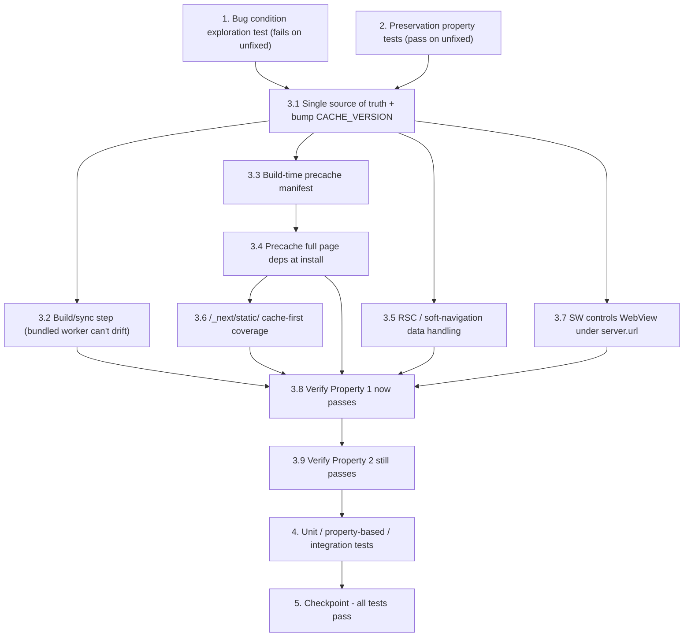

# Implementation Plan

## Overview

This plan fixes offline rendering of the allowlisted pages (`/practice`, `/pricing`, `/privacy`, `/terms`, `/refund-policy`, `/about`, `/contact`, `/roadmap`, `/ssb/day-1..day-5`) in the Capacitor Android WebView (`server.url` mode), where the SERVED `public/sw.js` is the authoritative worker. It follows the exploratory bugfix methodology: surface the bug first (Property 1), lock in current behavior (Property 2), then apply the three coordinated fix parts (reconcile diverged workers + bump `CACHE_VERSION`, build-time precache manifest of each route's render-dependency set, and RSC/soft-navigation network-first data handling) with a build/sync step so the bundled worker cannot drift.

## Tasks

- [x] 1. Write bug condition exploration test
  - **Property 1: Bug Condition** - Allowlisted Pages Render Offline In The WebView
  - **CRITICAL**: This test MUST FAIL on unfixed code - failure confirms the bug exists
  - **DO NOT attempt to fix the test or the code when it fails**
  - **NOTE**: This test encodes the expected behavior - it will validate the fix when it passes after implementation
  - **GOAL**: Surface counterexamples that demonstrate the bug against the SERVED `public/sw.js` (the authoritative worker for the Capacitor Android WebView in `server.url` mode), and confirm/refute the hypothesized root causes (worker divergence, missing chunk precache, no RSC handling)
  - **Scoped PBT Approach**: Property is `for all X where isBugCondition(X) holds`, i.e. `X.isOffline = true AND normalize(X.pathname) IN OFFLINE_ROUTES`. Scope generation to the 13 concrete allowlisted routes (`/practice`, `/pricing`, `/privacy`, `/terms`, `/refund-policy`, `/about`, `/contact`, `/roadmap`, `/ssb/day-1..day-5`) crossed with both navigation modes (`hard`, `soft`) for reproducibility
  - Test implementation details from Bug Condition in design (`isBugCondition(X)` over `{ pathname, isOffline, mode }`):
    - Simulate offline navigations against the current served-worker routing/precache logic (via `lib/offline/sw-helpers.ts` + `lib/offline/offline-routes.ts` and the `public/sw.js` install/fetch behavior)
    - Case A — Never-visited hard load: offline hard load of `/about` after only the shell was cached; assert full content renders (expected fail: `/_next/static/` chunks never cached)
    - Case B — Soft navigation RSC: offline soft navigation to `/roadmap`; assert content renders (expected fail: RSC request with `RSC` header / `?_rsc=` is passed through, never cached)
    - Case C — Visited-then-reload: view `/terms` online, go offline, reload; assert hydrated content (expected fail if referenced chunks weren't all cached)
    - Case D — Worker identity: assert the controlling worker under `server.url` is the served `public/sw.js` version, not the bundled `v1` (reveals the divergence)
    - Case E — Edge deep route: offline hard load of `/ssb/day-5`; assert full render (expected fail like the others)
  - The test assertions should match the Expected Behavior Properties from design: `renders_actual_page_content(result) AND NOT is_offline_fallback(result) AND NOT is_blank_or_broken(result)`
  - Run test on UNFIXED code
  - **EXPECTED OUTCOME**: Test FAILS (this is correct - it proves the bug exists)
  - Document counterexamples found to understand root cause (e.g. "cached HTML for `/about` present but page blank because chunks absent"; "soft-nav RSC fetch to `/roadmap` fails offline and is never cached")
  - Mark task complete when test is written, run, and failure is documented
  - _Requirements: 1.1, 1.2, 1.3, 1.4_

- [x] 2. Write preservation property tests (BEFORE implementing fix)
  - **Property 2: Preservation** - All Non-Bug Inputs Unchanged
  - **IMPORTANT**: Follow observation-first methodology
  - Observe behavior on UNFIXED code for inputs where `isBugCondition(X)` is false, then encode it:
    - Observe: online navigations (`isOffline = false`) to any route render live from network — record decisions
    - Observe: offline navigation to `/account` (not allowlisted) shows the existing offline popup/fallback (`OfflineNavGuard` / `/offline`)
    - Observe: non-GET requests and network-only APIs (auth, payments, AI evaluation/chat, current affairs, leaderboards, notifications, streak, OIR) bypass cache via `isNetworkOnly(url, method)`
    - Observe: `/` and `/offline` routes behave as today
    - Observe: on activation, caches not owned by the current version are deleted (`cachesToDelete`)
  - Write property-based tests capturing observed behavior patterns from Preservation Requirements (Req 3.1–3.5):
    - Over randomized `X = {pathname, isOffline, mode}` where `isBugCondition(X)` is false: assert fixed routing decision equals original routing decision (`navigate_original(X) = navigate_fixed(X)`)
    - Over randomized requests (methods, hosts, paths): assert `isNetworkOnly` classification unchanged
    - Over randomized cache-name sets: assert `cachesToDelete` retains exactly the owned set and deletes everything else (aside from the intended `CACHE_VERSION` bump)
    - Include a case ensuring a non-allowlisted-route RSC request stays passthrough
  - Property-based testing generates many test cases for stronger guarantees
  - Run tests on UNFIXED code
  - **EXPECTED OUTCOME**: Tests PASS (this confirms baseline behavior to preserve)
  - Mark task complete when tests are written, run, and passing on unfixed code
  - _Requirements: 3.1, 3.2, 3.3, 3.4, 3.5_

- [x] 3. Fix for offline allowlisted pages not rendering in the Capacitor Android WebView

  - [x] 3.1 Establish a single source of truth for the Service Worker and reconcile divergence
    - Make `public/sw.js` the authoritative served worker (controls the WebView in `server.url` mode); treat `lib/offline/sw-helpers.ts` (shared pure logic) and `lib/offline/offline-routes.ts` (allowlist) as the shared source
    - Reconcile `public/sw.js` so its allowlist and cache-naming match `offline-routes.ts` / `sw-helpers.ts`; resolve the three-way divergence (`public/sw.js` v3 vs bundled v1 vs `sw-helpers.ts` v1)
    - Bump a single `CACHE_VERSION` so a fresh worker activates and old caches are cleaned up
    - _Bug_Condition: isBugCondition(X) where X.isOffline = true AND normalize(X.pathname) IN OFFLINE_ROUTES_
    - _Expected_Behavior: expectedBehavior(result) — renders actual page content from cache, never fallback/blank/broken_
    - _Preservation: activation cache cleanup and cache naming unchanged except the intended CACHE_VERSION bump_
    - _Requirements: 1.4, 2.1, 2.4, 3.5_

  - [x] 3.2 Add a build/sync step so the bundled worker can never drift
    - Add an npm script (e.g. `cap:copy` running `npx cap copy android`, and/or a small sync script) that always regenerates `android/app/src/main/assets/public/sw.js` from `public/sw.js`
    - Document that under `server.url` the served copy is the one that runs; the bundled copy only matters in bundled-asset (`webDir`) mode
    - _Bug_Condition: isBugCondition(X) — divergence hides the authoritative worker (bug 1.4)_
    - _Expected_Behavior: bundled worker byte-identical to served worker after build_
    - _Preservation: no runtime behavior change in server.url mode_
    - _Requirements: 1.4, 2.4_

  - [x] 3.3 Generate a build-time precache manifest of each route's render-dependency set
    - Add a build script (e.g. `scripts/gen-offline-manifest.mjs`) run after `next build`, emitting a manifest (e.g. `public/offline-manifest.json` or inlined constant in `public/sw.js`)
    - For each route in `OFFLINE_ROUTES`, resolve from `.next/` the exact content-hashed URLs it needs: the route document, its page/layout/runtime JS chunks under `/_next/static/`, associated CSS, and the route's RSC payload URL
    - Inject the manifest into the worker for use at `install`
    - _Bug_Condition: isBugCondition(X) — per-page JS chunks / RSC not precached (bugs 1.1, 1.3)_
    - _Expected_Behavior: manifest lists complete render-dependency set for every allowlisted route_
    - _Preservation: manifest covers only OFFLINE_ROUTES; no other route added_
    - _Requirements: 2.3_

  - [x] 3.4 Precache full page dependencies at install
    - Extend the `install` handler in `public/sw.js` to precache, for every allowlisted route, its document (into `PAGES`) + all manifest-listed `/_next/static/` chunks/CSS (into `STATIC`) + its RSC payload (into a new data cache)
    - Keep the critical app shell all-or-nothing; make per-page precache resilient so a single page failure does not abort install
    - _Bug_Condition: isBugCondition(X) — cached HTML present but chunks/RSC missing_
    - _Expected_Behavior: expectedBehavior(result) — document + required chunks + RSC available offline_
    - _Preservation: `/` and `/offline` shell precache behavior unchanged_
    - _Requirements: 2.1, 2.3_

  - [x] 3.5 Add RSC / soft-navigation data handling (network-first with cache fallback)
    - In the `public/sw.js` `fetch` handler, add a strategy helper detecting RSC/data requests for allowlisted routes (request has `RSC` header, URL has `?_rsc=`, or response is `text/x-component`)
    - Serve them network-first with cache fallback into a dedicated data cache so offline soft navigations render
    - Non-allowlisted RSC requests keep today's passthrough behavior
    - _Bug_Condition: isBugCondition(X) where X.mode = 'soft' — RSC request not handled (bug 1.2)_
    - _Expected_Behavior: expectedBehavior(result) — soft navigation renders cached RSC content offline_
    - _Preservation: non-allowlisted RSC requests remain passthrough (Req 3.2, 3.3)_
    - _Requirements: 2.2_

  - [x] 3.6 Keep `/_next/static/` cache-first and guarantee coverage
    - Retain cache-first for `/_next/static/` in the `fetch` handler
    - Ensure the precache manifest (3.3) guarantees chunks for allowlisted routes are present even if a page was never individually visited online
    - _Bug_Condition: isBugCondition(X) — never-visited page has no cached chunks (bug 1.1)_
    - _Expected_Behavior: chunks served from cache offline_
    - _Preservation: cache-first strategy for `/_next/static/` unchanged for non-allowlisted contexts_
    - _Requirements: 2.1, 2.3_

  - [x] 3.7 Ensure the Service Worker actually controls the WebView under `server.url`
    - Confirm the release `capacitor.config.ts` points `server.url` at the HTTPS origin (`https://www.lakshyassb.online`) so the SW registers in a secure context, and that `allowNavigation` permits it
    - Verify `components/offline/ServiceWorkerRegister.tsx` registers `/sw.js` at scope `/` and that registration/activation happens during an online session
    - Keep the `/sw.js` `no-cache` + `Service-Worker-Allowed: /` headers in `next.config.ts` so new worker versions are picked up
    - Note the operational precondition: offline rendering requires at least one prior online launch that registers and activates the worker
    - _Bug_Condition: isBugCondition(X) inside the Android WebView (bug 1.4)_
    - _Expected_Behavior: served worker controls WebView; offline navigations served from cache_
    - _Preservation: `/` and `/offline` registration/headers behavior unchanged_
    - _Requirements: 2.4, 3.4_

  - [x] 3.8 Verify bug condition exploration test now passes
    - **Property 1: Expected Behavior** - Allowlisted Pages Render Offline In The WebView
    - **IMPORTANT**: Re-run the SAME test from task 1 - do NOT write a new test
    - The test from task 1 encodes the expected behavior
    - When this test passes, it confirms the expected behavior is satisfied (full page content from cache, no fallback/blank/broken) for all `X` where `isBugCondition(X)` holds
    - Run bug condition exploration test from step 1
    - **EXPECTED OUTCOME**: Test PASSES (confirms bug is fixed)
    - _Requirements: 2.1, 2.2, 2.3, 2.4_

  - [x] 3.9 Verify preservation tests still pass
    - **Property 2: Preservation** - All Non-Bug Inputs Unchanged
    - **IMPORTANT**: Re-run the SAME tests from task 2 - do NOT write new tests
    - Run preservation property tests from step 2
    - **EXPECTED OUTCOME**: Tests PASS (confirms no regressions)
    - Confirm all tests still pass after fix (online rendering, non-allowlisted offline routes, network-only/mutation passthrough, `/` and `/offline`, activation cache cleanup)
    - _Requirements: 3.1, 3.2, 3.3, 3.4, 3.5_

- [x] 4. Add supporting unit, property-based, and integration tests
  - Unit tests: `isNetworkOnly(url, method)` classification (GET/non-GET, whitelisted GET APIs, payment hosts, enumerated online-only paths); `isOfflineRoute`/allowlist normalization (trailing slash) for all 13 allowlisted routes and representative non-allowlisted routes; RSC-request detection helper; precache-manifest consumption (per-page failures don't abort install); cache naming + `cachesToDelete` after the `CACHE_VERSION` bump
  - Property-based tests: over randomized `X = {pathname, isOffline, mode}`, bug-condition inputs select a cache-serving path (document + chunks + RSC) and non-bug inputs match original routing; over randomized cache-name sets, `cachesToDelete` retains exactly the owned set
  - Integration tests: Android WebView end-to-end under `server.url` (load online once to register+activate, go offline, hard-load and soft-navigate each allowlisted route, assert real content); worker-sync equality check (`android/app/src/main/assets/public/sw.js` identical to `public/sw.js` after build + sync/`cap copy`); context switching (offline soft-nav between allowlisted routes renders, non-allowlisted route still shows offline popup); update flow (new `CACHE_VERSION` cleans old caches and pages still render offline)
  - _Requirements: 2.1, 2.2, 2.3, 2.4, 3.1, 3.2, 3.3, 3.4, 3.5_

- [x] 5. Checkpoint - Ensure all tests pass
  - Ensure all tests pass (exploratory bug-condition, fix checking, preservation checking, unit, property-based, integration), ask the user if questions arise.

## Task Dependency Graph



```json
{
  "waves": [
    { "wave": 1, "tasks": ["1", "2"], "dependencies": [] },
    { "wave": 2, "tasks": ["3.1"], "dependencies": ["1", "2"] },
    { "wave": 3, "tasks": ["3.2", "3.3", "3.5", "3.7"], "dependencies": ["3.1"] },
    { "wave": 4, "tasks": ["3.4"], "dependencies": ["3.3"] },
    { "wave": 5, "tasks": ["3.6"], "dependencies": ["3.4"] },
    { "wave": 6, "tasks": ["3.8"], "dependencies": ["3.2", "3.4", "3.5", "3.6", "3.7"] },
    { "wave": 7, "tasks": ["3.9"], "dependencies": ["3.8"] },
    { "wave": 8, "tasks": ["4"], "dependencies": ["3.9"] },
    { "wave": 9, "tasks": ["5"], "dependencies": ["4"] }
  ]
}
```

## Notes

- Property 1 (Bug Condition) MUST fail on unfixed code; Property 2 (Preservation) MUST pass on unfixed code. Do not attempt to fix code while writing the exploration test.
- The SERVED `public/sw.js` is authoritative for the Android app in `server.url` mode; the bundled `android/app/src/main/assets/public/sw.js` is regenerated from it and is inert at runtime while `server.url` points at a remote origin.
- Shared source of truth for worker logic/allowlist: `lib/offline/sw-helpers.ts` and `lib/offline/offline-routes.ts`.
- Offline rendering has an operational precondition: at least one prior online launch must register and activate the worker.
- Scope is strictly the 13 allowlisted routes; all non-bug inputs (online navigations, offline non-allowlisted routes, network-only/mutation passthrough, `/` and `/offline`, activation cache cleanup) must remain unchanged.
