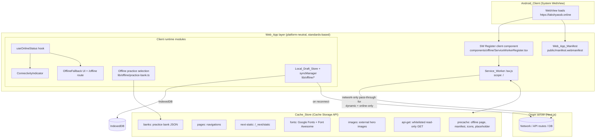
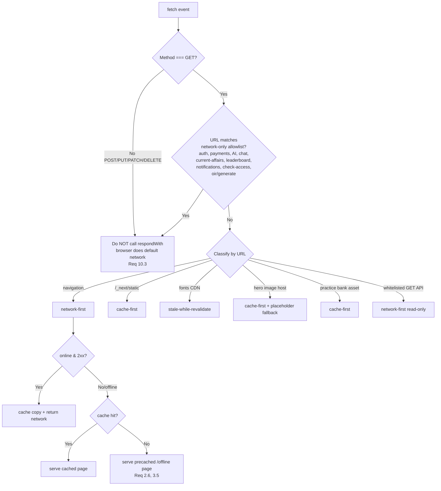

# Design Document: Offline Support

## Overview

This design adds scoped offline support to the LakshyaSSB Next.js 16 (App Router) web app so that,
when the Capacitor Android System WebView loads `https://lakshyassb.online` with no connectivity, a
defined set of static and read-only capabilities remain usable, and every internet-dependent
capability degrades into a friendly offline state instead of a native WebView error page.

Because the Android client loads a **remote URL** (`capacitor.config.ts` → `server.url =
'https://lakshyassb.online'`) and bundles **no web assets** (`webDir: 'public'` is only a type
placeholder), offline support cannot be delivered through Capacitor's native asset bundle. It MUST
be delivered at the **web layer** through:

1. A **Service Worker** (`Service_Worker`) served from the production origin root that intercepts
   requests and serves cached responses when offline.
2. A **Web App Manifest** (`Web_App_Manifest`) for metadata and installability.
3. A set of **client-side modules** (connectivity detection, offline practice selection, a local
   draft store with deferred submission, and offline fallback UI).

The entire implementation is standards-based and platform-neutral (Requirement 11): no Capacitor
plugin, native bridge, or Android-specific API is used. The same code enables a future iOS client
once an iOS project with App-Bound Domains is added; iOS build/test is explicitly deferred.

### Design goals

- **Non-breaking (Requirement 10):** online behavior is byte-for-byte identical. The Service Worker
  passes dynamic and online-only requests straight to the network and never substitutes a cached
  response for them.
- **Minimal footprint:** zero new runtime dependencies (see the Service Worker mechanism decision).
  Only additive files plus three small, surgical edits to existing files (`app/layout.tsx`,
  `next.config.ts`, and the OIR test client).
- **Graceful degradation everywhere:** if the Service Worker fails to register, the app runs exactly
  as it does today over direct network requests, and surfaces a non-blocking "offline support
  unavailable" indication.

### Scope summary

| Capability | Offline behavior | Requirement |
|---|---|---|
| App shell, landing page, footer | Served from cache | 1, 2 |
| Static study pages (SSB day-1..5, roadmap, PIQ form UI) | Served from cache after first online visit | 3 |
| Practice banks (OIR, SRT, WAT) | Served from cache; questions selected client-side; no DB history | 4 |
| Previously loaded GET data | Served from cache, read-only | 5 |
| User drafts (PIQ, SRT, WAT sentence drafting) | Saved to `Local_Draft_Store`; auto-submitted on reconnect | 6 |
| Auth, payments, AI eval/chat, current affairs, leaderboards, notifications, mutations | Offline fallback UI (never a WebView error) | 7 |
| Connectivity state | Detected + shown via status indicator | 8 |
| Cache updates on new release | Versioned caches, cleaned up on activate | 9 |

## Architecture

### High-level component view



### Request-flow decision (online vs offline)

The Service Worker's `fetch` handler classifies every request and applies exactly one strategy. The
first matching rule wins.



**Why this satisfies Requirement 10 (preserve online behavior):**

- Non-GET requests and every online-only URL return **before** `event.respondWith(...)` is called,
  so the WebView performs its normal network fetch and the server response (or the server/network
  error) reaches the app unchanged (Req 10.1–10.4).
- Navigations and whitelisted GET APIs use **network-first**: while online they always return the
  live server response and only fall back to cache when the network fails (offline).

### Runtime platform note (Requirement 1.8, 11.2)

The Android System WebView (Chromium-based) implements the Service Worker and Cache Storage APIs
identically to Chrome. Nothing in this design branches on `Capacitor.isNative` or any platform flag;
the caching/serving logic in the `fetch`/`install`/`activate` handlers runs the same in a browser
tab and in the WebView. HTTPS is already satisfied because the WebView loads the `https://` origin,
which is a secure context and permits Service Worker registration.

## Components and Interfaces

### 1. Service Worker mechanism decision (Requirement 1, 11)

**Decision: a hand-authored service worker at `public/sw.js` (plain JavaScript, no build step),
registered by a small client component. Zero new dependencies.**

Rationale and alternatives considered:

| Option | Verdict | Reasoning |
|---|---|---|
| `next-pwa` | Rejected | Unmaintained; no App Router / Next 16 support. |
| `@serwist/next` (Serwist) | Rejected for now | Modern next-pwa successor and supports App Router, but its Next plugin hooks the bundler and its Turbopack support is still evolving. Next 16 builds with **Turbopack by default**, and the project has a hard constraint to avoid bleeding-edge breakage (TypeScript pinned 5.9.x, ESLint 9.x). Introducing a bundler-coupled plugin risks the `next build`. |
| **Hand-authored `public/sw.js` + client registration** | **Chosen** | Served as a plain static file from `public/`, completely decoupled from Turbopack/webpack — the build never processes it. Fully standards-based (satisfies Req 11.1, 11.3 with no platform-specific code). Zero runtime dependency additions. Full control over caching strategies and versioning. |

Because `public/sw.js` is not transpiled, it is authored in browser-native ES (no TypeScript, no
imports). A companion source-of-truth constant file documents the version and allowlists in the repo
for review, but the shipped artifact is the plain JS file.

**Serving, scope, registration, HTTPS:**

- **Served from origin root.** Files in `public/` are served at `/`, so `public/sw.js` is available
  at `https://lakshyassb.online/sw.js`. A service worker's scope is capped at the path it is served
  from; serving at root gives it scope `/` (whole origin). The manifest and icons live in `public/`
  too.
- **Headers (via `next.config.ts` `headers()`):** `/sw.js` is served with
  `Cache-Control: no-cache` (so a new release's worker is picked up promptly) and
  `Service-Worker-Allowed: /` (defensive, keeps root scope explicit). This is the only functional
  change to `next.config.ts`.
- **Registration:** a `'use client'` component `ServiceWorkerRegister` is mounted once in
  `app/layout.tsx` (inside `<body>`). It registers on `window.load` and guards on
  `'serviceWorker' in navigator` and `window.isSecureContext`. Registration is initiated well within
  5 seconds of page load (Req 1.1). If `navigator.serviceWorker.register('/sw.js', { scope: '/' })`
  rejects, the component sets a global "offline support unavailable" flag consumed by the indicator
  (Req 1.7) and the app continues on direct network.

```ts
// components/offline/ServiceWorkerRegister.tsx (interface sketch)
'use client';
export default function ServiceWorkerRegister(): null;
// - registers /sw.js on load; scope '/'
// - on success: listens for 'updatefound' to surface update availability
// - on failure: dispatches window event 'lssb:sw-unavailable'
```

### 2. Web App Manifest (Requirement 1.2, 11.4)

- **File:** `public/manifest.webmanifest`, linked from `<head>` in `app/layout.tsx`
  (`<link rel="manifest" href="/manifest.webmanifest" />`).
- **Fields:** `name`, `short_name`, `start_url: "/"`, `display: "standalone"`, `background_color`
  (`#1c1c1c`, matching the existing splash), `theme_color` (`#FF5E3A`, brand orange), `icons`.
- **Icons (Req 1.2):** at minimum `192x192` and `512x512` PNG icons under `public/icons/`
  (`icon-192.png`, `icon-512.png`, plus a `512` `purpose: "maskable"` entry). These are generated
  from the existing `public/LSSB_logo.png`.
- **Platform neutrality (Req 11.4):** the manifest uses only standard W3C members — no Android-only
  keys — so no web-layer change is needed to enable iOS later.

### 3. Connectivity detection + status indication (Requirement 8, 11)

- **Hook `hooks/useOnlineStatus.ts`:** returns the current connectivity state derived from
  `navigator.onLine`, updated by subscribing to the `window` `online`/`offline` events. Standards
  based, no native plugin (Req 11.1). Initializes synchronously from `navigator.onLine` so the first
  render already reflects state at launch (Req 8.5).

```ts
// hooks/useOnlineStatus.ts
export type ConnectivityState = 'online' | 'offline';
export function useOnlineStatus(): ConnectivityState;
```

- **Component `components/offline/ConnectivityIndicator.tsx`:** a small, non-intrusive badge
  (fixed, low-corner) that shows an offline pill when offline and a brief "back online" pill on
  transition to online, then auto-hides. Mounted once in `components/LayoutWrapper.tsx` so it is
  present on every navigable page (it already wraps all non-`/auth` routes). Transitions render
  within the 2s budget because they are driven directly by the browser events (Req 8.3, 8.4).
- It also renders a subtle "offline support unavailable" state when it receives the
  `lssb:sw-unavailable` event (Req 1.7).

### 4. Offline practice selection module (Requirement 4)

Today the three practice flows differ:

- **SRT** (`app/practice/srt/page.tsx`) and **WAT** (`app/practice/wat/page.tsx`) already `import`
  their bank JSON directly, so the questions are bundled into the client `/_next/static` chunk. Once
  that chunk is cached (cache-first), these banks are already available offline — no data refactor
  needed, only offline-aware gating (skip `check-access`, skip AI submit).
- **OIR** (`app/practice/oir/test/page.tsx`) fetches `/api/oir/generate`, which runs on the server,
  reads JSON, and (for logged-in users) writes per-user history via Prisma. This path is
  DB-dependent and unavailable offline, so OIR needs a cacheable static-asset path.

**Static bank assets (Req 4.1, 4.2):** a build-time script copies `data/practice/*.json` into
`public/practice-banks/` and emits an index describing each bank with a stable, versioned URL.

- **Script:** `scripts/generate-practice-banks.mjs`, run via a `prebuild`/`predev` npm script. It
  writes `public/practice-banks/index.json`:

```json
{
  "version": "<build id / content hash>",
  "banks": [
    { "id": "oir_analogy", "file": "/practice-banks/oir_analogy.json", "count": 42 },
    { "id": "srt01", "file": "/practice-banks/srt01.json", "count": 60 }
  ]
}
```

- The versioned URL requirement is met by the `version` field plus the per-release cache version;
  the SW caches these under the banks cache (cache-first, Req 4.3 sub-1000ms because it is a local
  Cache Storage read).

**Client selection module `lib/offline/practice-bank.ts`** (pure, framework-free — the primary
property-based-testing target):

```ts
export interface RawQuestion { question?: string; options?: string[]; answer?: string; [k: string]: unknown; }

// Validate a parsed bank into >= 1 well-formed question (Req 4.7)
export function validateBank(parsed: unknown): { ok: true; questions: RawQuestion[] } | { ok: false; reason: string };

// Deterministic, seedable selection so it is testable (Req 4.4)
export function selectQuestions(pool: RawQuestion[], count: number, rng?: () => number): RawQuestion[];
// Guarantees: 1 <= result.length <= pool.length; result.length === clamp(count, 1, pool.length);
// every element is a member of pool; no duplicate references.

export async function loadBankFromCache(bankId: string): Promise<RawQuestion[]>; // fetch + validateBank
```

**Offline branch in the OIR test client (Req 4.4–4.7):** `app/practice/oir/test/page.tsx` gains an
offline path. When `useOnlineStatus()` is `offline`:

1. Skip `/api/practice/check-access` (both GET gate and POST consume) — these are online-only.
2. Instead of `fetch('/api/oir/generate')`, load bank(s) from `/practice-banks/*` via
   `loadBankFromCache`, then `selectQuestions(pool, randomCount)` client-side where `randomCount`
   is in `[1, pool.length]` (Req 4.4).
3. If no bank is cached, or it fails to parse into ≥1 question, render `OfflineFallback` and do not
   start the flow, preserving any in-progress answers (Req 4.6, 4.7).
4. On submit while offline, skip the DB-backed history / streak calls; show results locally
   (Req 4.5). The **online path is unchanged**: when `online`, the component runs exactly today's
   logic (access check → `/api/oir/generate` → server history).

SRT/WAT get the analogous, smaller change: when offline, `handleStart` skips `check-access` and the
flow proceeds against the already-bundled questions; the AI evaluation submit (`/api/srt/submit`,
`/api/wat/submit`) is treated as an online-only action (draft-and-defer per Requirement 6, below).

### 5. Local draft store + deferred submission (Requirement 6)

**Storage choice: IndexedDB** (via a tiny hand-rolled wrapper, `lib/offline/idb.ts`, no dependency).

Rationale over `localStorage`: IndexedDB is asynchronous (never blocks the WebView main thread
during autosave), has a much larger quota (localStorage is ~5 MB and synchronous), and stores
structured records natively. This matters because SRT/WAT/PIQ drafts can be large free-text sets.

**Modules:**

```ts
// lib/offline/idb.ts — minimal promise wrapper over IndexedDB (open, get, put, delete, getAll)

// lib/offline/draftStore.ts
export interface Draft {
  id: string;                 // stable per (flow, entity) e.g. "piq" or "srt:<sessionId>"
  flow: 'piq' | 'srt' | 'wat' | 'tat' | 'gpe' | 'lecturette';
  payload: unknown;           // the flow's submission body
  endpoint: string;           // where it will POST on reconnect
  updatedAt: number;
  status: 'draft' | 'pending' | 'failed';
  attempts: number;           // retry counter
}
export function saveDraft(d: Draft): Promise<'saved' | 'quota-exceeded'>; // Req 6.1, 6.7
export function listPending(): Promise<Draft[]>;
export function removeDraft(id: string): Promise<void>;                   // Req 6.4

// lib/offline/syncManager.ts
export function computeBackoffSchedule(): number[];  // [5000,10000,20000,40000,80000] ms (Req 6.6)
export function nextDelay(attempts: number): number | null; // null after 5 attempts
export async function flushPending(): Promise<void>;  // called on reconnect (Req 6.3)
```

**Autosave (Req 6.1):** each in-scope drafting flow debounces input and calls `saveDraft` within 2s
of the user pausing, always overwriting with the latest content for that draft id.

**Pending indicator (Req 6.2):** a `useDraftSync` hook exposes `{ pendingCount, lastResult }`; a
small badge shows "Saved locally — not yet submitted" whenever a `pending`/`failed` draft exists.

**Reconnect sync (Req 6.3–6.6):** `syncManager.flushPending()` runs when `useOnlineStatus`
transitions to `online`. For each pending draft it POSTs to `draft.endpoint` (starting within 10s of
detection, Req 6.3). On success it removes the draft and shows a success indicator (Req 6.4). On
failure it retains the unmodified draft, shows "failed — will retry", and reschedules using
`nextDelay(attempts)` — increasing intervals starting at 5s, up to 5 attempts — after which it shows
"manual retry required" (Req 6.5, 6.6).

**Storage-full (Req 6.7):** `saveDraft` catches `QuotaExceededError`, keeps the previously stored
version intact, and returns `'quota-exceeded'` so the flow can show "latest changes couldn't be
saved locally".

**In scope now:** PIQ form draft, and SRT/WAT/TAT/GPE/lecturette answer drafting (their submissions
are online-only AI evaluations, the exact case Requirement 6 targets). **Deferred:** flows with no
user-authored submission payload.

### 6. Offline fallback UI (Requirement 3, 5, 7)

- **Reusable component `components/offline/OfflineFallback.tsx`:** props
  `{ title?, message?, onRetry? }`. Renders a branded, friendly "needs an internet connection"
  panel with an optional retry control. Online-only pages and cache-miss study pages render this
  instead of failing.
- **Precached offline route `app/offline/page.tsx`:** a static page precached at SW install. The SW
  serves it for any **uncached navigation** while offline (Req 2.6, 3.5), guaranteeing the WebView
  never shows a native network error (Req 7.6).
- **Online-only route guarding (Req 7.1–7.5):** online-only feature pages (auth, payments, AI
  chat/eval, current affairs, leaderboards, notifications, account mutations) use `useOnlineStatus`;
  when offline they render `OfflineFallback` within 2s instead of attempting the request, and
  re-enable automatically when connectivity returns (Req 7.5). Read-only cached data views disable
  create/edit/delete controls while offline (Req 5.2, 5.4).

### 7. Read-only cached data views (Requirement 5)

Whitelisted GET API responses (see allowlist) are cached network-first. Offline, the last cached
response is served (Req 5.1). Views that render such data check `useOnlineStatus`; when offline they
disable mutating controls and, if a datum was never cached, render `OfflineFallback` for that datum
(Req 5.3). Any attempted mutation offline is blocked client-side with an error indication and the
cached data is left unchanged (Req 5.4); the mutating request itself is network-only at the SW layer
so it is never satisfied from cache (Req 10.3).

## Data Models

### Cache_Store naming (Requirement 9.1)

Every cache name embeds a single `CACHE_VERSION`, so all entries are associated with exactly one
`Cache_Version`.

```js
// public/sw.js
const CACHE_VERSION = 'v1';              // bump per release
const PRECACHE   = `lssb-precache-${CACHE_VERSION}`;   // offline page, manifest, icons, placeholder, LSSB_logo
const PAGES      = `lssb-pages-${CACHE_VERSION}`;      // navigations (landing + static study pages)
const NEXTSTATIC = `lssb-next-static-${CACHE_VERSION}`;// /_next/static/*
const FONTS      = `lssb-fonts-${CACHE_VERSION}`;      // Google Fonts + Font Awesome CDN
const IMAGES     = `lssb-images-${CACHE_VERSION}`;     // external hero images
const APIGET     = `lssb-api-get-${CACHE_VERSION}`;    // whitelisted read-only GET responses
const BANKS      = `lssb-banks-${CACHE_VERSION}`;      // practice bank JSON
const OWNED = new Set([PRECACHE, PAGES, NEXTSTATIC, FONTS, IMAGES, APIGET, BANKS]);
```

On `activate`, any cache whose name is not in `OWNED` is deleted (Req 1.6, 9.2).

### Precache manifest (App_Shell — Requirement 1.3, 1.4)

```js
const PRECACHE_URLS = [
  '/offline',                         // offline fallback route
  '/manifest.webmanifest',
  '/icons/icon-192.png',
  '/icons/icon-512.png',
  '/LSSB_logo.png',
  '/images/hero-placeholder.png'      // shared placeholder for failed hero images (Req 2.3)
];
```

Install uses an **all-or-nothing** precache: if any URL fails, the install promise rejects, the new
worker does not activate, the previously cached shell is retained, and the install is reported as
failed (Req 1.4).

### Route / asset classification tables

**Cached navigations — Static_Study_Content + landing (Req 2, 3):**

| Route | Class |
|---|---|
| `/` | landing (network-first, cache fallback) |
| `/about` | static study/nav |
| `/roadmap` | Static_Study_Content |
| `/ssb/day-1` … `/ssb/day-5` | Static_Study_Content |
| `/piq` , `/piq/form` | Static_Study_Content (PIQ form UI) |
| `/piq-builder` | static |

**Cache-first classes:**

| Pattern | Cache | Notes |
|---|---|---|
| `/_next/static/**` | `NEXTSTATIC` | content-hashed → immutable |
| `/practice-banks/**` | `BANKS` | Practice_Bank assets (Req 4) |
| `fonts.googleapis.com`, `fonts.gstatic.com`, `cdnjs.cloudflare.com` | `FONTS` | stale-while-revalidate; system-font fallback if miss (Req 2.4) |
| `images.unsplash.com`, `images.pexels.com`, `www.ssbcrack.com` | `IMAGES` | cache-first; placeholder fallback (Req 2.3) |

**Whitelisted read-only GET API (Req 5.1) — network-first, cache fallback:**
`/api/auth/status` (read), and other explicitly read-only GET viewing endpoints. These are cached
only so previously loaded data can be re-viewed offline; they remain network-first so online is
always live.

**Network-only allowlist — never cached, passed through (Req 7.4, 10.3):**

- All non-GET requests (POST/PUT/PATCH/DELETE): every mutation.
- `/api/auth/*` (login/signup/Google), Razorpay (`checkout.razorpay.com`, `api.razorpay.com`,
  `/api/payment*`), AI evaluation (`/api/srt/submit`, `/api/wat/submit`, `/api/tat/*`, `/api/piq/*`),
  AI chat mentor (Gemini), current affairs/news, leaderboards, notifications,
  `/api/practice/check-access`, `/api/streak/*`, and `/api/oir/generate`.

### Local_Draft_Store schema (Requirement 6)

IndexedDB database `lssb-offline`, object store `drafts` (keyPath `id`), index on `status`. Record
shape is the `Draft` interface in §5. A single record per draft id holds the latest content
(overwritten on autosave), its target `endpoint`, `status`, and `attempts` counter used by the
backoff schedule.

## Correctness Properties

*A property is a characteristic or behavior that should hold true across all valid executions of a
system — essentially, a formal statement about what the system should do. Properties serve as the
bridge between human-readable specifications and machine-verifiable correctness guarantees.*

These properties cover this feature's **pure, framework-free logic**: the offline
question-selection module, the practice-bank validator, the Service Worker's cache-name/versioning
and request-classification helpers, and the draft-store queue logic. The Service Worker's *runtime*
caching/serving behavior, timing bounds, manifest content, and UI rendering are verified by
integration, example, and smoke tests instead (see Testing Strategy). To keep those helpers pure and
testable, the SW's classification and cache-name functions are authored in a plain module and mirrored
into `public/sw.js`; the selection/validation/draft logic lives in `lib/offline/*` and is imported
directly by tests.

### Property 1: Offline question selection is bounded and faithful

*For any* non-empty practice-bank pool and *any* requested count, `selectQuestions(pool, count)`
returns a list whose length equals `clamp(count, 1, pool.length)`, where every returned element is a
member of `pool` and no element reference appears more than once.

**Validates: Requirements 4.4**

### Property 2: Bank validation accepts exactly valid banks

*For any* parsed JSON value, `validateBank(value)` returns `ok: true` with a non-empty question list
if and only if the value is an array containing at least one well-formed question (having the fields
the flow requires); for every other value (non-array, empty array, or malformed entries) it returns
`ok: false`, and in that case the practice flow does not start.

**Validates: Requirements 4.7**

### Property 3: Cache cleanup retains exactly the owned caches

*For any* set of existing cache names present in the `Cache_Store`, the activation cleanup routine
deletes every cache name that is not in the current `OWNED` set and retains every cache name that is
in `OWNED`, so that after cleanup the surviving names are exactly `existing ∩ OWNED`.

**Validates: Requirements 1.6, 9.2**

### Property 4: Cache names encode exactly one version (round-trip)

*For any* cache base name and *any* `CACHE_VERSION` string, the derived cache name produced by the
naming helper encodes that version such that parsing the version back out of the name yields the
original version, and all names in a single `OWNED` set share one and the same version.

**Validates: Requirements 9.1**

### Property 5: Dynamic and online-only requests are never served from cache

*For any* request, `isNetworkOnly(url, method)` returns `true` for every non-GET method and for every
enumerated online-only endpoint (login/signup/Google auth, payments/Razorpay, AI evaluation, AI chat
mentor, current affairs, leaderboards, notifications, access-check, streak, and OIR generation), and
returns `false` for cacheable classes (app shell, static study pages, `/_next/static`, fonts, hero
images, practice banks, whitelisted read-only GET APIs); whenever `isNetworkOnly` is `true` the
Service Worker does not substitute a cached response (it passes the request through to the network).

**Validates: Requirements 7.4, 10.1, 10.2, 10.3**

### Property 6: Saved drafts are never silently lost (data integrity / retention)

*For any* draft saved to the `Local_Draft_Store`, the draft remains retrievable with a byte-identical
payload until it is explicitly acknowledged by a successful server submission; a failed submission
leaves the draft present and unmodified (status `failed`), and a blocked offline scoring submission
leaves the user's entered answers fully recoverable.

**Validates: Requirements 6.5, 7.2**

### Property 7: Retry backoff schedule is bounded and strictly increasing

*For any* attempt count, `computeBackoffSchedule()` yields exactly 5 intervals that are strictly
increasing with a first interval of 5000 ms, and `nextDelay(attempts)` returns a defined interval for
`attempts` in `0..4` and `null` for `attempts >= 5` (signalling manual retry required). A draft that
receives a successful submission is subsequently absent from the store (save → acknowledge → absent
round-trip).

**Validates: Requirements 6.4, 6.6**

## Error Handling

| Failure | Handling | Requirement |
|---|---|---|
| SW registration rejects | Catch in `ServiceWorkerRegister`; app continues on direct network; dispatch `lssb:sw-unavailable`; indicator shows offline support unavailable | 1.7 |
| Precache resource fails at install | All-or-nothing `cache.addAll`; install promise rejects; new worker does not activate; prior shell retained | 1.4 |
| Navigation cache miss while offline | Serve precached `/offline` route (never a native error) | 2.6, 3.5, 7.6 |
| `cache.match` throws while serving a study page | Catch; serve `OfflineFallback`; other cached entries untouched | 3.6 |
| Hero image miss/timeout offline | Return cached placeholder response (same layout box via CSS) | 2.3 |
| CDN font miss offline | System/cached fallback font-family keeps text visible | 2.4 |
| Practice bank missing from cache | `OfflineFallback`; retain in-progress answers; do not start flow | 4.6 |
| Bank parses to `<1` question | `validateBank` returns `ok:false`; `OfflineFallback`; do not start flow | 4.7 |
| Mutation attempted offline | Block client-side; SW keeps mutations network-only; cached data unchanged; error shown | 5.4, 10.3 |
| Draft submission fails | Retain unmodified draft; "failed, will retry"; backoff up to 5; then "manual retry" | 6.5, 6.6 |
| IndexedDB `QuotaExceededError` | Keep previously saved draft; warn "latest changes couldn't be saved locally" | 6.7 |
| Cache deletion fails on activate | Retain current caches; keep serving; record failure flag for retry next activation | 9.3 |
| Version update fetch times out / non-2xx | Discard partial version; retain current; retry after 60s up to 3 times | 9.5 |
| Online-only request fails while online | Pass-through means the original server/network error surfaces unchanged; no cache substitution | 10.4 |

## Testing Strategy

A dual approach: **property-based tests** for pure logic (Properties 1–7) and **example /
integration / smoke tests** for Service Worker runtime behavior, UI, timing, and configuration.

### Property-based tests

- **Library:** `fast-check` (TypeScript-native, works with the existing tooling; a dev-only
  dependency — flagged below). A test runner is required; the repo currently has none, so add
  **Vitest** as a dev dependency (fast, ESM/TS-native, does not touch the Next production build).
- Each property test runs **≥ 100 iterations**.
- Each test is tagged with a comment: `// Feature: offline-support, Property {n}: {property text}`.
- Targets (one property-based test each):
  - Property 1 → `selectQuestions` (`lib/offline/practice-bank.ts`)
  - Property 2 → `validateBank`
  - Property 3 → cache cleanup helper
  - Property 4 → cache-name/version helper
  - Property 5 → `isNetworkOnly` request classifier
  - Property 6 → `draftStore` save/retrieve/retention (fake-indexeddb in Vitest)
  - Property 7 → `computeBackoffSchedule` / `nextDelay` + success round-trip

### Example / unit tests

- SW registration failure fallback (1.7); manifest field/schema check (1.2); precache
  all-or-nothing with an injected failing URL (1.4); connectivity hook transitions and initial
  state (8.1–8.5); read-only control gating offline (5.2, 5.4); draft autosave timing and pending
  indicator (6.1, 6.2); reconnect flush begins within budget (6.3); quota-exceeded warning (6.7);
  offline scoring "not sent" message (7.3).

### Integration tests (Chrome DevTools → Android WebView mapping)

- **Chrome DevTools "Offline" throttling** validates the SW end-to-end on the same Chromium engine
  the Android System WebView uses, so results map directly:
  1. Load online, confirm caches populate (Application → Cache Storage).
  2. Toggle Offline; verify landing, footer, the 7 static study pages, and practice banks serve from
     cache within their time budgets (2.1, 3.1–3.4, 4.3).
  3. Verify uncached navigations and online-only routes render the offline fallback, never a network
     error (2.6, 3.5, 7.1, 7.6).
  4. Verify online-only/dynamic requests pass through and are never cache-substituted (10.1–10.4).
  5. Bump `CACHE_VERSION`, reload, confirm old caches are deleted and new ones created (1.6, 9.2, 9.6).
  6. Draft offline, go online, confirm deferred submission and draft removal (6.3, 6.4).
- **Android WebView parity (1.8, 11.2):** run the same offline checklist inside a debug build
  (`chrome://inspect` remote debugging of the WebView) to confirm identical behavior.

### Smoke / compliance tests

- Post-build assertions that `public/manifest.webmanifest`, `public/icons/icon-192.png`,
  `public/icons/icon-512.png`, and `public/practice-banks/index.json` + bank files exist (1.2, 4.1).
- A lint/grep guard asserting the offline layer (`public/sw.js`, `lib/offline/*`) contains **no**
  Capacitor/native references, enforcing platform neutrality (11.1, 11.3, 11.5).

## Requirements Traceability Matrix

| Requirement | Design element(s) |
|---|---|
| **1** SW + Manifest foundation | `public/sw.js` (install precache all-or-nothing, activate cleanup), `ServiceWorkerRegister` component, `public/manifest.webmanifest` + icons, `next.config.ts` headers; Properties 3, 4 |
| **2** Offline landing + footer | Navigation network-first + cache fallback (`PAGES`), `IMAGES` placeholder fallback, `FONTS` SWR fallback, precached `/offline`; existing non-blocking auth in `app/page.tsx` |
| **3** Static study content | `PAGES` cache for the 7 routes, `OfflineFallback` + `/offline` on miss/error |
| **4** Practice banks offline | `scripts/generate-practice-banks.mjs` → `public/practice-banks/*`, `lib/offline/practice-bank.ts`, offline branch in OIR/SRT/WAT clients, `BANKS` cache; Properties 1, 2 |
| **5** Offline viewing of loaded data | `APIGET` network-first cache, read-only UI gating via `useOnlineStatus`, `OfflineFallback`; Property 5 (mutations stay network-only) |
| **6** Drafting + deferred submission | `lib/offline/idb.ts`, `draftStore.ts`, `syncManager.ts`, `useDraftSync`, draft indicators; Properties 6, 7 |
| **7** Graceful degradation | Network-only allowlist in SW, `OfflineFallback`, online-only route guards, `/offline`; Properties 5, 6 |
| **8** Connectivity detection + indication | `hooks/useOnlineStatus.ts`, `ConnectivityIndicator` in `LayoutWrapper` |
| **9** Cache versioning + update | `CACHE_VERSION`-based cache names, activate cleanup, update retry policy; Properties 3, 4 |
| **10** Preserve online behavior | `isNetworkOnly` pass-through (return before `respondWith`), network-first for cacheable dynamic-ish classes; Property 5 |
| **11** Platform scope | Hand-authored standards-based SW (no plugin), standard manifest, no native references; smoke/compliance guard |

## Risks and Edge Cases

- **SW + Turbopack build:** mitigated by serving a hand-authored `public/sw.js` that the bundler
  never processes, so Turbopack/webpack changes cannot break it. This also honors the pinned-version
  constraint (TypeScript 5.9.x, ESLint 9.x) — no bundler-coupled plugin is introduced.
- **Caching HTML for a client-rendered, auth-aware app:** the landing and study pages are `'use
  client'` and some read auth via `/api/auth/status`. We cache the **navigation document** but keep
  `/api/auth/status` network-first and rely on the existing localStorage auth cache so a cached page
  never shows stale logged-in chrome as fresh; auth-dependent content resolves once online.
- **Auth cookies + cached responses:** only explicitly whitelisted **read-only** GET responses are
  cached; all auth/mutation traffic is network-only, so we never serve a cached response containing
  another session's data. GET API caching is opt-in per endpoint to avoid caching personalized data
  unintentionally.
- **Staleness:** `CACHE_VERSION` bump on each release plus `no-cache` on `/sw.js` and network-first
  navigations bound staleness; `/_next/static` is safe to cache-first because it is content-hashed.
- **`skipWaiting`/`clients.claim`:** the worker calls `skipWaiting()` on install and `clients.claim()`
  on activate so a new version takes control promptly; drafts live in IndexedDB and survive worker
  replacement, so mid-session data is not lost. (Trade-off noted: an in-flight page may switch asset
  versions on next navigation; acceptable for this largely-static app.)
- **iOS deferral:** no iOS project exists; WKWebView needs App-Bound Domains configured on
  macOS/Xcode. The web layer is standards-only so enabling iOS later requires no web changes
  (Req 11.3, 11.4).
- **Dependency-compatibility constraint:** the only additions are **dev-only** test tooling
  (`vitest`, `fast-check`, `fake-indexeddb`); **zero runtime dependencies** are added. Exact pinned
  versions are decided at implementation time and must not force TypeScript ≥ 6 or ESLint ≥ 10.

## Decisions Requiring Confirmation

1. **New dependencies (dev-only):** `vitest`, `fast-check`, `fake-indexeddb` for the property/unit
   tests. No runtime dependencies added. Serwist/next-pwa explicitly **not** added.
2. **Modified existing files (surgical):**
   - `app/layout.tsx` — add manifest `<link>`, mount `ServiceWorkerRegister`.
   - `components/LayoutWrapper.tsx` — mount `ConnectivityIndicator`.
   - `next.config.ts` — add `headers()` for `/sw.js` (`Cache-Control: no-cache`,
     `Service-Worker-Allowed: /`).
   - `app/practice/oir/test/page.tsx` — add offline branch (skip access-check, client-side
     selection, skip DB history).
   - `app/practice/srt/page.tsx`, `app/practice/wat/page.tsx` — offline-aware `handleStart`
     (skip access-check) and draft-and-defer submit.
   - `package.json` — add `predev`/`prebuild` to run the bank generator; add test scripts.
   - **`capacitor.config.ts` is NOT changed** (`server.url` stays as-is).
3. **New files:** `public/sw.js`, `public/manifest.webmanifest`, `public/icons/icon-192.png`,
   `public/icons/icon-512.png`, `public/images/hero-placeholder.png`,
   `components/offline/ServiceWorkerRegister.tsx`, `components/offline/ConnectivityIndicator.tsx`,
   `components/offline/OfflineFallback.tsx`, `app/offline/page.tsx`, `hooks/useOnlineStatus.ts`,
   `hooks/useDraftSync.ts`, `lib/offline/idb.ts`, `lib/offline/draftStore.ts`,
   `lib/offline/syncManager.ts`, `lib/offline/practice-bank.ts`, `lib/offline/sw-helpers.ts`
   (shared pure classifiers mirrored into `sw.js`), `scripts/generate-practice-banks.mjs`.
